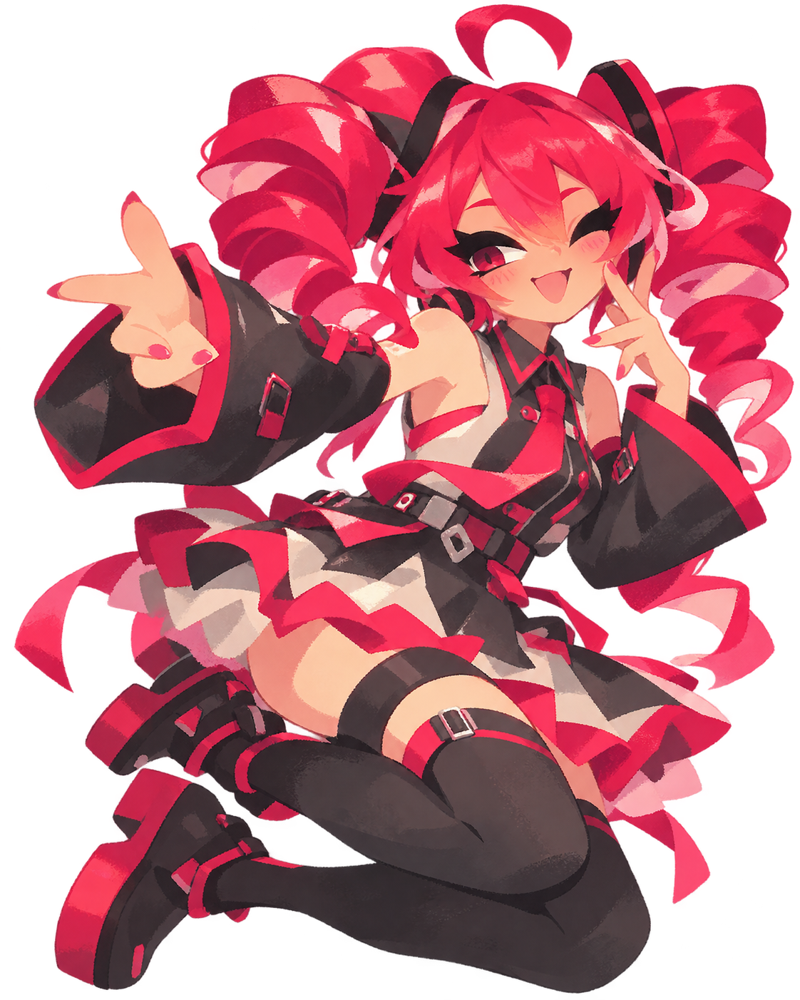
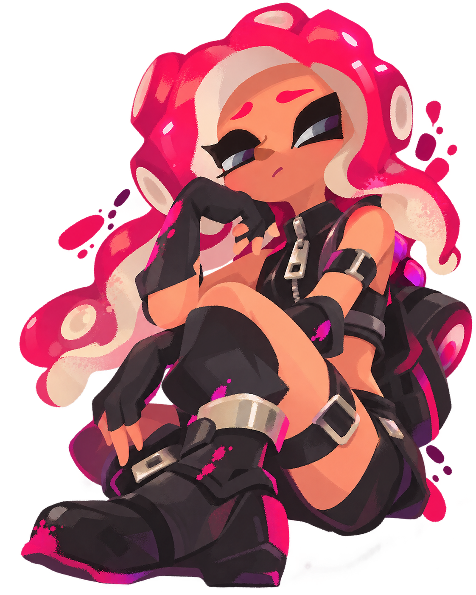

<div align="center">


<br>


<br>

<b>Desarrollador de Software en Emkode</b>

<br>

<sub>
✦ Agente 8 Lover ✦ Gamer ✦ Escritor
</sub>

</div>

---

# ✦ Sobre mí

Soy **Daniel Avila**, aunque en internet suelo aparecer como **Danifoxuwu**.

Actualmente trabajo como **Desarrollador de Software en Emkode**.

Mi trabajo se enfoca principalmente en desarrollo **web**, **backend** y **aplicaciones móviles**, además de integraciones entre plataformas, APIs, automatización y mantenimiento de sistemas.

Fuera del desarrollo, paso bastante tiempo entre videojuegos, escritura, roleplay y proyectos personales.

Me gustan especialmente:

`Minecraft` · `Splatoon` · `Tomodachi Life` · `Forsaken` · `Kasane Teto`

# ✦ `whoami`

```txt
Nombre      : Daniel Avila
Usuario     : Danifoxuwu
Trabajo     : Emkode
Rol         : Desarrollador de Software

Enfoque     : Web
              Backend
              Mobile

Intereses   : Programación
              Escritura
              Roleplay
              Videojuegos

Favoritos   : Splatoon
              Minecraft
              Tomodachi Life
              Forsaken
              Kasane Teto

Estado      : trabajando
              aprendiendo
              escribiendo
              pensando en otro proyecto
```

---

# ✦ Tecnologías

<div align="center">

### Lenguajes


<br><br>

### Frameworks


<br><br>

### Herramientas


</div>

---

# ✦ Experiencia

## Emkode

Actualmente trabajo como desarrollador de software en **Emkode**, participando en desarrollo, mantenimiento e integración de soluciones web y móviles.

He trabajado principalmente con:

```txt
Desarrollo web
Desarrollo móvil
APIs REST
Integraciones
Webhooks
Automatización
Bases de datos
Mantenimiento de sistemas
Publicación de aplicaciones
Servicios externos
```

---

# ✦ Proyectos

## Bounty League

Plataforma competitiva desarrollada con **Django**, integración con **Discord** y servicios propios para gestión de partidas, participantes y resultados.

Incluye:

```txt
Gestión de participantes
Sistema de bounties
Gestión de recompensas
Bot de Discord
Reporte de resultados
Gestión de partidas
Panel administrativo
Integración de pagos
Sistema de sorteos
API propia
Integración con Unity
```

Tecnologías:

`Django` · `Python` · `Discord Bot` · `API REST` · `Unity` · `PostgreSQL`

---

## Infrared Insight

Aplicación móvil desarrollada con **Flutter** enfocada en análisis termográfico como apoyo para el prediagnóstico de cáncer de mama.

Trabajé en:

```txt
Levantamiento de requerimientos
Desarrollo por sprints
Integración del algoritmo
Diseño del flujo de la aplicación
Prototipo funcional
Documentación
```

Tecnologías:

`Flutter` · `Dart`

---

## Sistema de Infracciones

Sistema web desarrollado con **Angular + Node.js** para captura y gestión de infracciones.

Incluye:

```txt
Gestión de vehículos
Gestión de infracciones
Captura mediante stepper
Generación de tickets PDF
Procesos administrativos
Compatibilidad con distintos dispositivos
```

Tecnologías:

`Angular` · `Node.js` · `TypeScript` · `JavaScript`

---

## Modernización de sistema de cobro municipal

Proyecto desarrollado durante mis residencias profesionales para modernizar un sistema de cobro de impuestos municipales.

El objetivo fue trasladar procesos existentes hacia una solución web y reducir la dependencia de instalaciones locales.

Trabajé con:

```txt
PostgreSQL
Control de consecutivos
Gestión de usuarios
Terminales bancarias
Pruebas de concurrencia
Pruebas automatizadas
Modernización de procesos
```

Tecnologías:

`PostgreSQL` · `Python` · `Web`

---

## Inteligencia Artificial

También he trabajado y experimentado con temas relacionados con inteligencia artificial.

Principalmente:

```txt
Búsqueda semántica
Embeddings
Procesamiento de información
Automatización
Integración de modelos
```

---

# ✦ También he trabajado con

```txt
APIs REST
Webhooks
OAuth2
PostgreSQL
MySQL
Docker
GitHub Actions
FTP Deploy
Google Play Console
TestFlight
Expo / EAS
Power BI
Moodle
Unity
Discord Bots
```

---

# ✦ Fuera del código

<div align="center">

`Minecraft`

`Splatoon`

`Tomodachi Life`

`Forsaken`

`Kasane Teto`

`Escritura`

`Roleplay`

`Worldbuilding`

</div>

<br>

<div align="center">



</div>

---

# ✦ Escritura y roleplay

Me gusta escribir personajes, escenas y mundos.

El roleplay es una de las formas en las que más disfruto escribir, especialmente cuando hay personajes con personalidad clara, relaciones que evolucionan y mundos con suficiente espacio para desarrollar historias.

Me interesa especialmente:

```txt
Construcción de personajes
Worldbuilding
Diálogos
Relaciones entre personajes
Historias largas
Continuidad narrativa
```

---

# ✦ Minecraft

<div align="center">


</div>

<br>

Minecraft es uno de esos juegos a los que siempre termino regresando.

Construir, explorar, empezar mundos nuevos y terminar haciendo proyectos mucho más grandes de lo que originalmente tenía planeado.

---

# ✦ Splatoon

Splatoon es probablemente una de las franquicias con las que más conecto visualmente.

Me gustan sus personajes, música, estética, mundo y dirección artística.

Y entre todos ellos:

<div align="center">

### ✦ Agente 8 Lover ✦



</div>

---

# ✦ Actualmente

```diff
+ trabajando en Emkode
+ desarrollando software
+ aprendiendo nuevas tecnologías
+ escribiendo
+ jugando cuando tengo tiempo
+ trabajando en proyectos personales
+ pensando en ideas nuevas

- terminando una idea antes de empezar otra
```

---

# ✦ GitHub

<div align="center">


</div>

<br>

---

# ✦ Un poco más sobre mí

```txt
Me gusta construir cosas que tengan utilidad.

Me gusta que los proyectos tengan identidad.

Me gusta escribir.

Me gustan los videojuegos.

Me gusta experimentar con ideas nuevas.

Y casi siempre termino aprendiendo algo
porque empecé un proyecto que terminó siendo
mucho más grande de lo que parecía.
```

---

# ✦ Contacto

<div align="center">

<a href="https://github.com/Danifoxuwu">
  
</a>

</div>

---

<div align="center">


<br><br>

### ✦ Daniel Avila // Danifoxuwu ✦

`Software Developer` · `Agente 8 Lover` · `Gamer` · `Writer`

<br><br>


<br><br>

✦ ───────────── ✦

</div>
