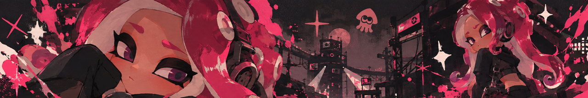

<div align="center">



<br>


<br>

<b>Desarrollador de Software en Emkode</b>

</div>

---

## Sobre mí

Soy **Daniel Avila**, desarrollador de software y actualmente trabajo en **Emkode**.

Me enfoco principalmente en desarrollo **web**, **backend** y **aplicaciones móviles**. Me gusta trabajar en proyectos reales, resolver problemas concretos y moverme entre distintas tecnologías dependiendo de lo que necesite cada proyecto.

Fuera del desarrollo, me gustan mucho los videojuegos, la escritura y el roleplay.

Entre las cosas que más me gustan están:

`Minecraft` · `Splatoon` · `Tomodachi Life` · `Forsaken` · `Kasane Teto` · `Escritura` · `Roleplay`

---

## `whoami`

```txt
Nombre      : Daniel Avila
Usuario     : Danifoxuwu
Trabajo     : Emkode
Rol         : Desarrollador de Software

Enfoque     : Web / Backend / Mobile

Intereses   : Programación
              Escritura
              Roleplay
              Videojuegos

Actualmente : trabajando, aprendiendo
              y probablemente pensando
              en otro proyecto
```

---

## Tecnologías

<div align="center">

### Lenguajes


<br><br>

### Frameworks y herramientas


<br><br>

### Bases de datos y herramientas de desarrollo


</div>

---

## Experiencia

### Emkode

Actualmente trabajo como desarrollador de software en **Emkode**, participando en desarrollo, mantenimiento e integración de soluciones web y móviles.

He trabajado principalmente con:

- desarrollo de aplicaciones web
- desarrollo de aplicaciones móviles
- APIs e integraciones
- webhooks
- automatización de procesos
- bases de datos
- mantenimiento de sistemas existentes
- publicación y preparación de aplicaciones
- integración entre plataformas y servicios externos

---

## Proyectos

### 🎯 Bounty League

Plataforma competitiva desarrollada con **Django**, integración con **Discord** y servicios propios para gestión de partidas, participantes y resultados.

El proyecto incluye:

- registro y gestión de participantes
- sistema de bounties y recompensas
- bot de Discord
- comandos para reporte de resultados
- gestión de partidas
- panel administrativo
- integración con pagos
- sistema de sorteos
- API propia para comunicación con clientes externos
- integración con Unity

Tecnologías principales:

`Django` · `Python` · `Discord Bot` · `API REST` · `Unity` · `PostgreSQL`

---

### 📱 Infrared Insight

Aplicación móvil desarrollada con **Flutter** enfocada en análisis termográfico como apoyo para el prediagnóstico de cáncer de mama.

Trabajé en:

- levantamiento de requerimientos
- desarrollo por sprints
- integración del algoritmo
- diseño del flujo de la aplicación
- construcción del prototipo funcional
- documentación del proyecto

Tecnologías principales:

`Flutter` · `Dart`

---

### 🏛️ Sistema de Infracciones

Sistema web desarrollado con **Angular + Node.js** para captura y gestión de infracciones.

Incluye:

- módulos de captura de información
- gestión de vehículos e infracciones
- flujo mediante stepper
- generación de tickets PDF
- integración de procesos administrativos
- soporte para uso desde distintos dispositivos

Tecnologías principales:

`Angular` · `Node.js` · `TypeScript` · `JavaScript`

---

### 💰 Modernización de sistema de cobro municipal

Proyecto desarrollado durante mis residencias profesionales para modernizar un sistema de cobro de impuestos municipales.

El objetivo fue trasladar procesos existentes hacia una solución web que redujera la dependencia de instalaciones locales.

Se trabajó con:

- base de datos PostgreSQL
- control de consecutivos
- manejo de usuarios
- integración con terminales bancarias
- pruebas de concurrencia
- pruebas automatizadas
- modernización de procesos existentes

Tecnologías principales:

`PostgreSQL` · `Python` · `Web`

---

### 🤖 Inteligencia Artificial

También he trabajado y experimentado con temas relacionados con inteligencia artificial, búsqueda semántica y manejo de información mediante embeddings.

Me interesan especialmente:

- búsqueda semántica
- embeddings
- procesamiento de información
- automatización
- integración de modelos dentro de aplicaciones

---

## También he trabajado con

```txt
APIs REST
Webhooks
OAuth2
PostgreSQL
MySQL
Docker
GitHub Actions
FTP Deploy
Google Play Console
TestFlight
Expo / EAS
Power BI
Moodle
Unity
Discord Bots
```

---

## Fuera del código

```txt
🎮 Minecraft
🦑 Splatoon
🌸 Tomodachi Life
🕹️ Forsaken
🎵 Kasane Teto
✍️ Escritura
🎭 Roleplay
🌌 Worldbuilding
```

---

## Escritura y roleplay

Me gusta escribir personajes, escenas y mundos.

El roleplay es una de las formas en las que más disfruto escribir, especialmente cuando hay personajes con personalidad clara, relaciones que evolucionan y mundos con suficiente espacio para desarrollar historias.

También me gusta trabajar con:

- construcción de personajes
- worldbuilding
- diálogos
- desarrollo de relaciones
- historias largas
- continuidad narrativa

---

## Cosas que me gustan

<div align="center">

`Minecraft`

`Splatoon`

`Tomodachi Life`

`Forsaken`

`Kasane Teto`

`Escritura`

`Roleplay`

`Videojuegos`

`Programación`

</div>

---

## GitHub

<div align="center">


</div>

<br>

<div align="center">


</div>

---

## Actualmente

```diff
+ trabajando en Emkode
+ desarrollando software
+ aprendiendo nuevas tecnologías
+ escribiendo
+ jugando algo cuando tengo tiempo
+ trabajando en proyectos personales
+ pensando en ideas nuevas

- terminando una idea antes de empezar otra
```

---

## Un poco más sobre mí

```txt
Me gusta construir cosas que tengan utilidad.

Me gusta que los proyectos se sientan bien hechos.

Me gusta escribir.

Me gustan los videojuegos.

Me gusta experimentar con ideas nuevas.

Y casi siempre termino aprendiendo algo nuevo
porque empecé un proyecto que probablemente
era más grande de lo que parecía.
```

---

## Contacto

<div align="center">

<a href="https://github.com/Danifoxuwu">
  
</a>

</div>

---

<div align="center">


<br>

### Daniel Avila // Danifoxuwu

`Software Developer` · `Gamer` · `Writer`

<br>


</div>
